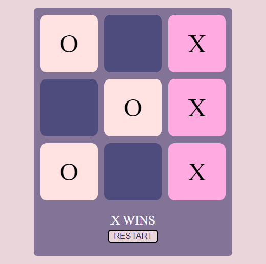
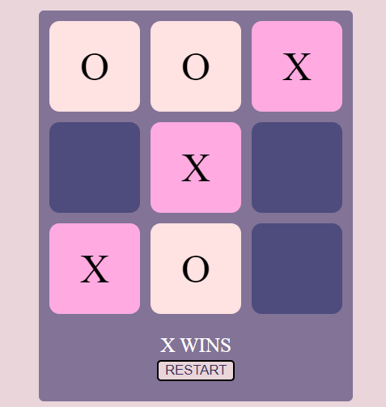
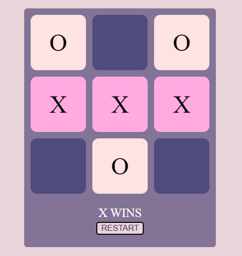
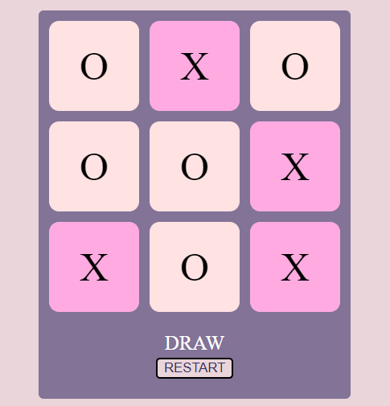

# Tic-Tac-Toe
A game developed in Java Script

## RULES
Tic-Tac-Toe is a simple and fun game for 2 players, X and O. It is played on a 3x3 grid. Each player's goal is to make 3 in a row.

O starts first, but in Gametable's Tabletop Tic Tac Toe, Player 1 starts first on the first game and Player 2 starts first on the next game. The starting player continues to alternate from game to game. This helps keep gameplay fair over time.

Players take turns placing their Mark, X or O, on an open square in the grid. The first player to make 3 of their own mark in a row vertically, horizontally, or diagonally wins the game.

If all 9 squares are filled and neither player has 3 in a row, the game is considered a Tie.

# Winning Conditions

Shown below are some of the winning conditions for 'X'.

# Draw Condition 

Shown below is one of the Draw Condition.

## Game Play 
As soon as you open the program on Browser , you will see a heading stating "Tic Tac Toe". Below heading there would be specified which player is using which symbol .i.e X or O to play. 

Below the player specification you will find a 3 X 3 grid of 9 boxes. Player 1 has to click on any one of the 9 boxes to mark an 'O' first. Then player 2 will mark an 'X' at one of remaining 8 boxes by clicking the box. This would continue untill one of the player "wins" or there is a "Draw". 

## ZERO-SUM GAME
Tic-Tac-Toe is a zero-sum game, which means that if both players are playing their best, the game will end in a Tie. However, if you learn how to play tic-tac-toe and master some simple strategies, then you'll be able to not only play, but to win the majority of the time.

## HISTORY
Tic-Tac-Toe is a long beloved classic pen and paper or board game for two players. Variations of Tic Tac Toe have been played since the Roman Empire and 3 in a row games can be traced all the way back to ancient Egypt!

## NOUGHTS AND CROSSES
Tic Tac Toe is known by a few other names around the world. The most common of these is "Noughts and Crosses" and it is sometimes simply referred to as the "XO game."
